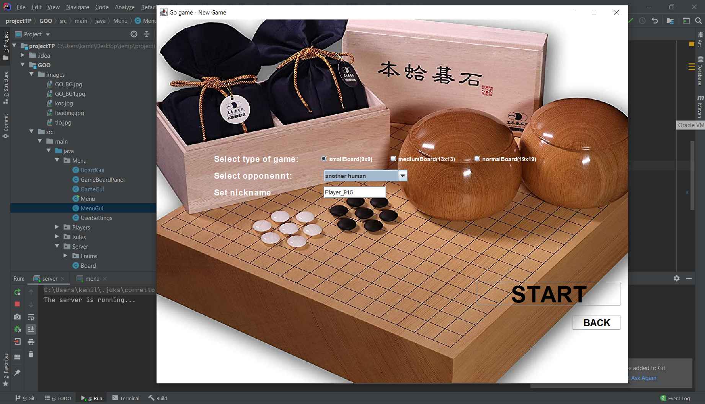
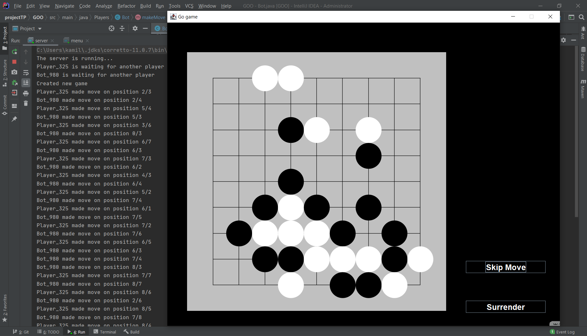

# GO Game
Java desktop aplication created for University project.

# Basic Rules
Go is an strategy board game for two players, where the aim is to surround more territory than the opponent.
The game was invented in China more than 2,500 years ago and is believed to be the oldest board game continuously played to the present day.
Players have black or white stones, and place them at line crossings. When player surrounds another player, the surronded player stones are taken from the board.
There are a lot more rules, and quite complicated, but the basics you should know before attempting to clone this repo and play can be read [here](https://en.wikipedia.org/wiki/Go_(game)#Rules).

# Functionalities
The server can suport two players, one one player and one bot. At the beginning the board size and opponent are chosen.
Then the game follows as the instructions on screen says. There are a bunch of functions that make sure both players remain connected to server, and the information is tarnfered without interruptions, as well as live checker if player is allowed to make that move.
The bot is not even near AI or any semi-intelligent program, but has a logic that allows him to win from time to time.

###### Options

###### Player vs Player

###### Player vs Bot

